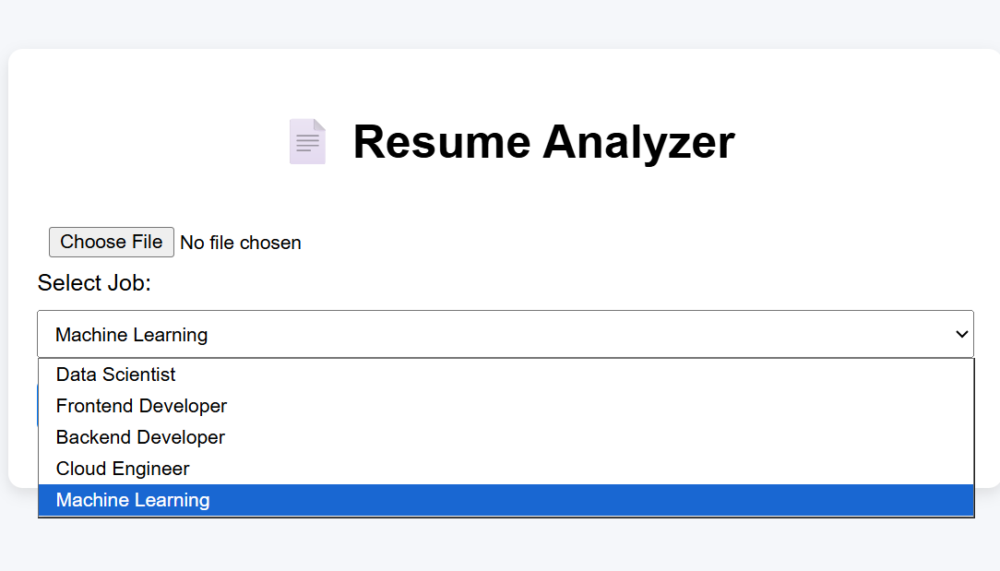
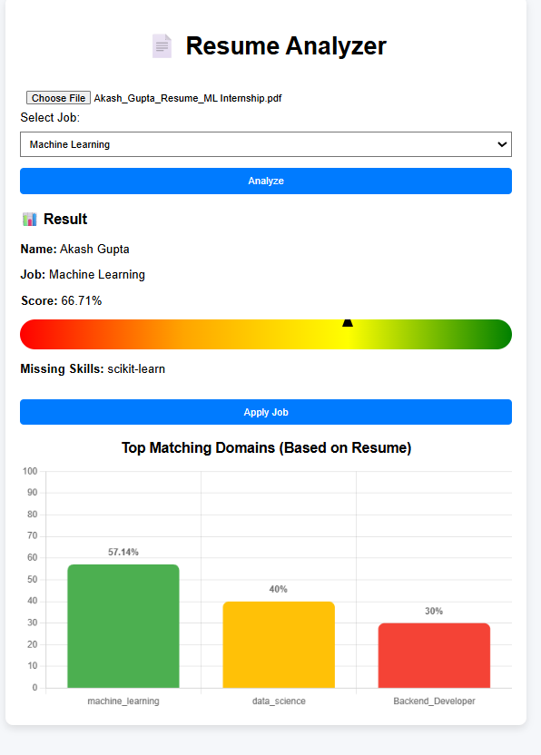
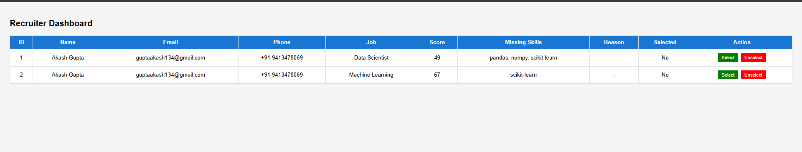
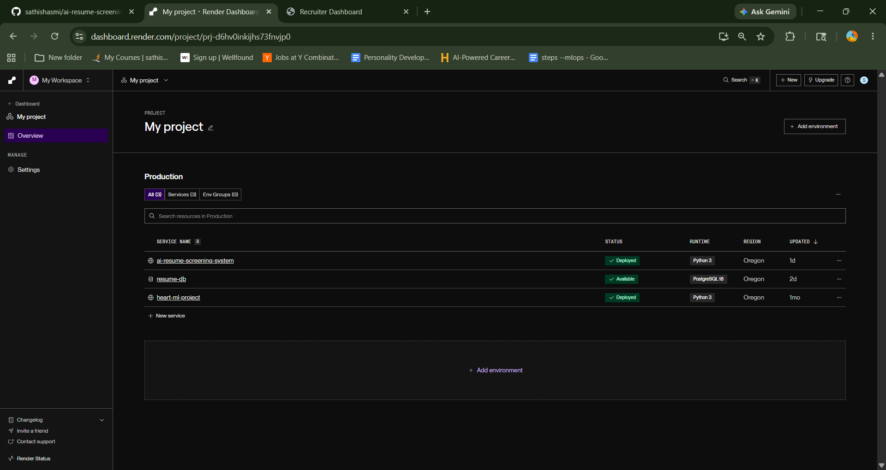

# AI Resume Screening System

An AI-powered Resume Screening System built using FastAPI, Machine Learning, and PostgreSQL.
This system analyzes resumes, calculates ATS scores, predicts top matching domains, and allows candidates to apply for jobs. Recruiters can view applied candidates through a recruiter dashboard.

# Datasets

This project uses custom datasets for training and testing the AI Resume Screening model.

##### ats_dataset.csv -> Main dataset containing resumes, job descriptions, and matching scores.
##### gpt_dataset.csv -> An AI-generated dataset used to improve resume-job similarity training. The raw data is cleaned, processed, and transformed into ats_dataset.csv, which is used for final model training and similarity prediction.

---

## Features

* Resume Upload System
* PDF Resume Parsing
* AI Resume Matching
* Skill Extraction
* Recruiter Dashboard
* Candidate Scoring
* PostgreSQL Database Integration
* FastAPI Backend
* Jinja2 Frontend Templates
* BERT-based Semantic Similarity

---
## Live Demo

### Candidate Homepage
#### https://ai-resume-screening-system-38ju.onrender.com/

### Recruiter Dashboard
#### https://ai-resume-screening-system-38ju.onrender.com/recruiter

## Screenshot 1 (Homepage)



## App Screenshot 2 (ATS Score)



## App Screenshot 3 (Recruiter Dashboard)



## Screenshot 4 (Render Deployment)


---

# Tech Stack

## Backend

* Python
* FastAPI
* SQLAlchemy
* PostgreSQL

## AI / Machine Learning

* PyTorch
* Transformers
* Sentence Transformers
* Scikit-learn

## Frontend

* HTML
* Jinja2 Templates

---

# Project Structure

```bash
Resume-Screening/
│
├── app/
│   ├── api/
│   │   ├── candidate.py
│   │   └── recruiter.py
│   │
│   ├── core/
│   │   └── database.py
│   │
│   ├── models/
│   │   ├── candidate.py
│   │   └── job.py
│   │
│   ├── services/
│   │   ├── matcher.py
│   │   ├── parser.py
│   │   └── skills.py
│   │
│   ├── templates/
│   │   ├── index.html
│   │   └── recruiter.html
│   │
│   ├── uploads/
│   │
│   └── main.py
│
├── datasets/
│   └── gpt_dataset.csv
│
├── uploads/
│
├── ats_dataset.csv
├── ats_dataset.ipynb
├── train_model.ipynb
├── download_model.py
├── resume_model.pth
├── requirements.txt
└── README.md
```

# AI Model

This project uses:

* BERT
* Sentence Transformers
* Cosine Similarity

The system compares:

* Resume Text
* Job Description

to generate semantic similarity scores.

---

# Resume Matching Workflow

1. Upload Resume
2. Extract Resume Text
3. Extract Skills
4. Generate Embeddings
5. Compare with Job Description
6. Generate Match Score

---

# 📋 Requirements

Main dependencies:

```txt
fastapi
uvicorn
sqlalchemy
psycopg2-binary
torch
transformers
sentence-transformers
scikit-learn
PyPDF2
jinja2
python-multipart
```
---

# 🚀 Future Improvements

* JWT Authentication
* Resume Ranking
* Admin Dashboard
* Docker Support
* Multi-job Matching
* GPU Optimization
* Better ATS Scoring

---

# 👨‍💻 Author

**Satheesh**

GitHub:  
https://github.com/sathishasmi
